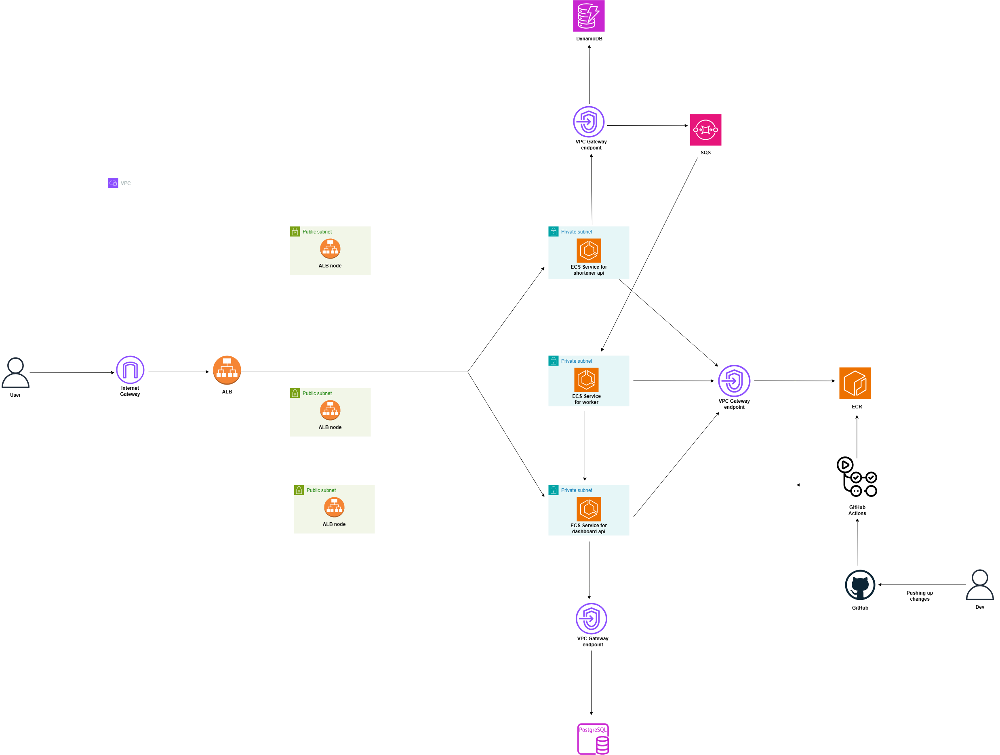
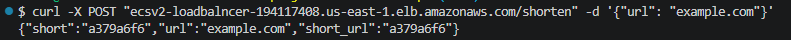
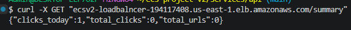
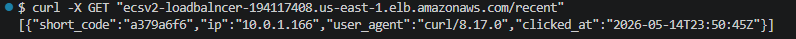

<h1>URL Shortener Project</h1>

<h2> Overview </h2>

This project involves deploying a URL shortener service that allows users to shorten any URL of their choosing. The following tech stack was used for this project: AWS, AWS CDK, Docker, Python, Go, and GitHub Actions. 

This README serves as a guide to help you provision the infrastructure for the URL shortener service. It will also outline various best practices used throughout the project and include decisions made along with their trade-offs.

<h2> Architectural Diagram </h2>

Below is the architectural diagram of the infrastructure we'll be setting up in this project:




<h2> Directory Structure </h2>

Below is an overview of the directory structure for this project:

```hcl
.
|-- README.md
|-- docker-compose.yaml
|-- infra
|   |-- -apporove
|   |   |-- asset.7fa1e366ee8a9ded01fc355f704cff92bfd179574e6f9cfee800a3541df1b200
|   |   |   |-- __entrypoint__.js
|   |   |   `-- index.js
|   |   |-- cdk.out
|   |   |-- ecrStack.assets.json
|   |   |-- ecrStack.template.json
|   |   |-- ecsStack.assets.json
|   |   |-- ecsStack.template.json
|   |   |-- manifest.json
|   |   `-- tree.json
|   |-- bin
|   |   `-- ecs-project-v2.ts
|   |-- cdk.json
|   |-- cdk.out
|   |   |-- asset.7fa1e366ee8a9ded01fc355f704cff92bfd179574e6f9cfee800a3541df1b200
|   |   |   |-- __entrypoint__.js
|   |   |   `-- index.js
|   |   |-- cdk.out
|   |   |-- dynamoDBStack.assets.json
|   |   |-- dynamoDBStack.template.json
|   |   |-- ecrStack.assets.json
|   |   |-- ecrStack.metadata.json
|   |   |-- ecrStack.template.json
|   |   |-- ecsStack.assets.json
|   |   |-- ecsStack.metadata.json
|   |   |-- ecsStack.template.json
|   |   |-- id.assets.json
|   |   |-- id.template.json
|   |   |-- manifest.json
|   |   |-- tree.json
|   |   |-- vpcStack.assets.json
|   |   `-- vpcStack.template.json
|   |-- jest.config.js
|   |-- lib
|   |   |-- config
|   |   |   |-- app-constants.ts
|   |   |   `-- app-settings.ts
|   |   |-- ecr-stack.ts
|   |   |-- ecs-stack.ts
|   |   `-- modules
|   |       |-- alb-construct.ts
|   |       |-- codedeploy-construct.ts
|   |       |-- dynamodb-construct.ts
|   |       |-- ecr-construct.ts
|   |       |-- ecs-construct.ts
|   |       |-- elasticacheredis-construct.ts
|   |       |-- iam-construct.ts
|   |       |-- postgresql-construct.ts
|   |       |-- sqs-construct.ts
|   |       |-- vpc-construct.ts
|   |       `-- waf-construct.ts
|   |-- package-lock.json
|   |-- package.json
|   |-- test
|   |   `-- ecs-project-v2.test.ts
|   `-- tsconfig.json
`-- services
    |-- api
    |   |-- Dockerfile
    |   |-- requirements.txt
    |   |-- src
    |   |   |-- db.py
    |   |   |-- events.py
    |   |   `-- main.py
    |   `-- tests
    |       |-- test_api.py
    |       `-- test_ddb.py
    |-- dashboard
    |   |-- Dockerfile
    |   |-- go.mod
    |   `-- main.go
    `-- worker
        |-- Dockerfile
        |-- go.mod
        `-- main.go
```

<h2> Prerequisites </h2>

In order to follow this project, you will need to have the following installed:

- ✅ An AWS Account with an IAM user (do not use the root account) - [Create An Account Here](https://aws.amazon.com/free/?trk=ce1f55b8-6da8-4aa2-af36-3f11e9a449ae&sc_channel=ps&ef_id=Cj0KCQjw782_BhDjARIsABTv_JCWZitQyH0tU_lYElDDQ9HdBabDxB-tKSgYDsRiU0N_XqiVVpjvBTUaAmR7EALw_wcB:G:s&s_kwcid=AL!4422!3!433803621002!e!!g!!aws%20sign%20up!9762827897!98496538743&gclid=Cj0KCQjw782_BhDjARIsABTv_JCWZitQyH0tU_lYElDDQ9HdBabDxB-tKSgYDsRiU0N_XqiVVpjvBTUaAmR7EALw_wcB&all-free-tier.sort-by=item.additionalFields.SortRank&all-free-tier.sort-order=asc&awsf.Free%20Tier%20Types=*all&awsf.Free%20Tier%20Categories=*all)

- ✅ Docker - [Download & Install](https://www.docker.com/get-started/)

- ✅Node.js & npm - [Download & Install](https://docs.npmjs.com/downloading-and-installing-node-js-and-npm)

- ✅ Typescript - [Download & Install](https://www.npmjs.com/package/typescript)

- ✅ AWS CDK - [Download & Install](https://docs.aws.amazon.com/cdk/v2/guide/getting-started.html)

<h2> Running the URL Shortener Service Locally </h2>

If you would like to run this setup locally, be sure to have certain resources running before bringing up all the container services within the docker-compose file. You will need to ensure you have the following configured:

- `POSTGRES_DB`, `POSTGRES_USER` and `POSTGRES_PASSWORD` environment variables all have a value configured for them in your docker-compose file.
- An environment variable for your DynamoDB table that you'll use to store the shortened URLs.
- The URL of the SQS queue that will be used for storing click events after a URL redirect occurs.
- A `.env` file configured with your AWS credentials and region, which will be used by your boto3 client when your container services are running.

Make sure the following are configured in your `.env` file:

```
AWS_ACCESS_KEY_ID="<INSERT VALUE>"
AWS_SECRET_ACCESS_KEY="<INSERT VALUE>"
AWS_DEFAULT_REGION="<INSERT VALUE>"
```

Once you have everything configured, go ahead and bring up all your containerised services in your docker-compose file:

```hcl
docker compose up -d
```
 
Run the `docker ps` command or check Docker Desktop to ensure that all containers are running successfully.

Once everything is running, go ahead and run the following commands to test the URL shortener service end-to-end locally:

```hcl
curl -X POST "localhost:8080/shorten" -d '{"url": "example.com"}'
``` 

You should get the following if you've run this command successfully:



The shortened ID and original URL are written to DynamoDB as an item, with the shortened ID acting as the partition key and the original URL as an attribute value.

Now go ahead and run this command to retrieve the original URL you sent by issuing a GET HTTP request with the short ID as the path (which you received from the previous command):

```hcl
curl -X GET "localhost/<your-shortid>"
``` 

After this command has run, a redirect (307) occurs to the original URL, which results in a click event (i.e. details around your shortened URL, original URL, etc.) being emitted and sent to an SQS queue.

This then triggers a worker application to 'poll' (i.e. retrieve) messages from your SQS queue, process them, and send them to a PostgreSQL database to be used by our dashboard service.

To retrieve information from the dashboard, go ahead and run either of these commands to view information on the processed click event you sent to the database:

```hcl
curl -X GET "localhost:8080/summary"
```



```hcl
curl -X GET "localhost:8080/recent"
``` 



You have successfully run the entire URL shortener service end-to-end on your local machine.

<h2> Running the URL Shortener Service on AWS </h2>

Now that we've got the service working locally, it's time to get this service running on AWS. There are several GitHub Actions workflows you'll need to run to get this service working on AWS:

- **Docker workflow** - Builds Docker images and pushes them to their respective ECR repositories.
- **CDK Diff workflow** - Runs `cdk diff` to show you what will be deployed.
- **CDK Deploy workflow** - Runs `cdk deploy` to deploys the resources.
- **CDK Destroy workflow** - Runs `cdk destroy` to destroy the resources.

Before you run any of these workflows, be sure to have an OIDC IAM role set up to allow your GitHub Actions runner to authenticate with AWS.

After you have run these workflows, go ahead and use the ALB DNS name with the paths used above to shorten your URL, retrieve the original URL, check the number of clicks, and view the most recent click events.

<h2> Architectural Decisions </h2>

You may have noticed that this project uses both DynamoDB and PostgreSQL databases: 
 
- **DynamoDB** is used for storing short IDs and original URLs. DynamoDB was selected due to it being serverless, meaning there is no underlying server infrastructure to manage. This comes with several benefits such as automatic scaling and high availability when the number of POST and GET http requests increases. 
 
- **PostgreSQL** is used for the dashboard due to its excellent capabilities at aggregating and joining data for queries such as retrieving recent click events or calculating the total click events that have been made.

<h2> Deployment Strategy </h2>

For this project, the deployment strategy I adopted was blue/green via AWS CodeDeploy for zero-downtime deployments. I originally wanted to go with ECS native blue/green deployments; however, the `elasticloadbalancer-v2` CDK library does not currently support the ALB configuration needed to work with ECS native blue/green deployments.

When deploying an updated image to ECS, new tasks will be started up within the green environment. These tasks are served with test traffic via the test listener I configured as part of this deployment strategy, whilst the blue tasks continue to serve production traffic. After a certain amount of time, the green tasks begin serving production traffic whilst the blue tasks continue running to ensure a quick rollback should the green tasks fail with production traffic. After the bake time has expired, the blue tasks will be terminated.


